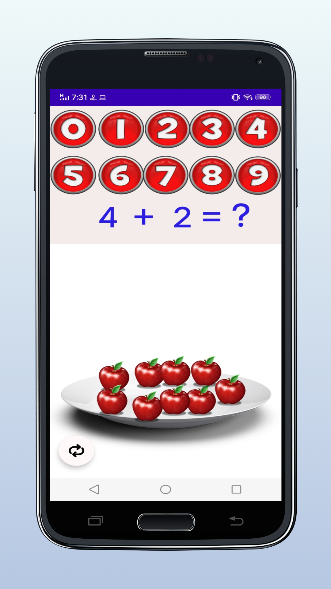
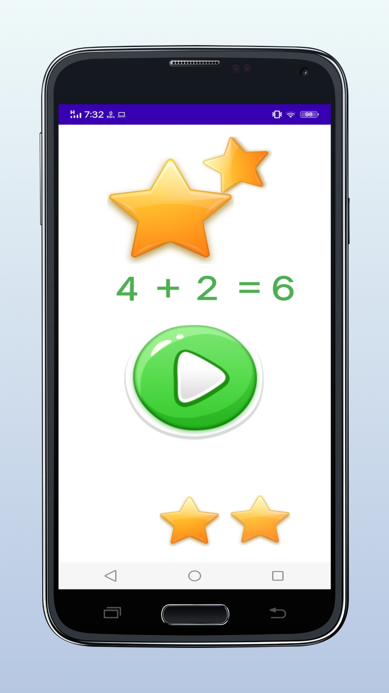

# Android-Quiz-Application

This app is a course project I co-created an Android application with a friend using Java and Android Studio. The app is an educational game designed for children, where users solve math expressions by dragging apples to represent numbers and calculate sums. It was a fun and interactive way to help kids learn basic arithmetic, and also a great hands-on experience in building engaging mobile interfaces and game logic.

  

